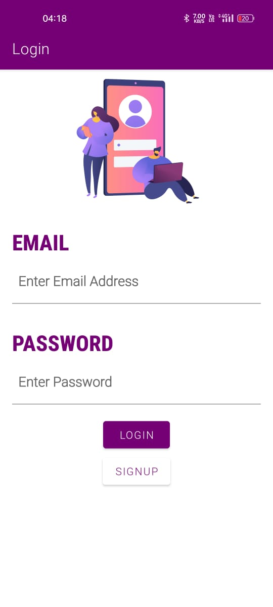
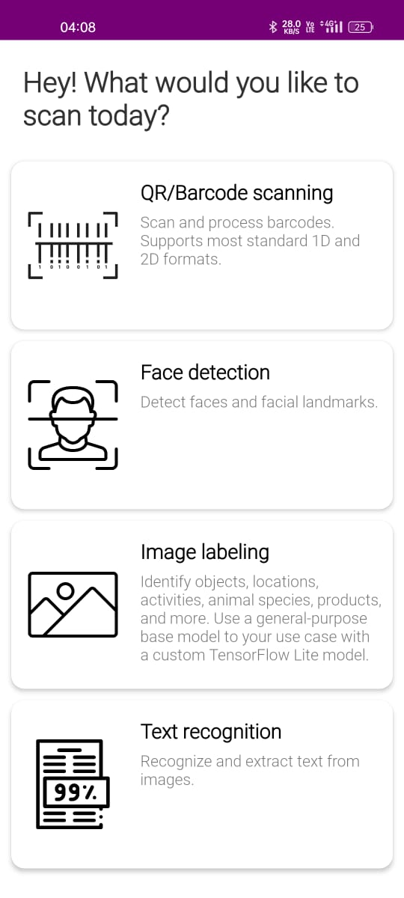
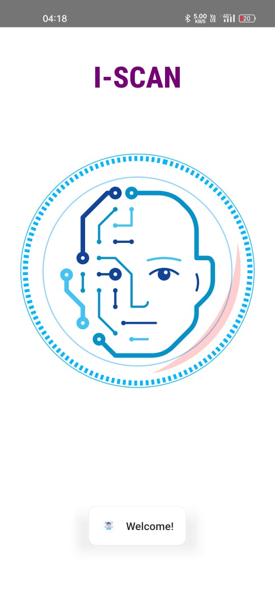
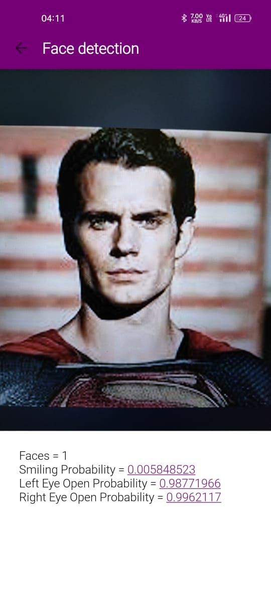
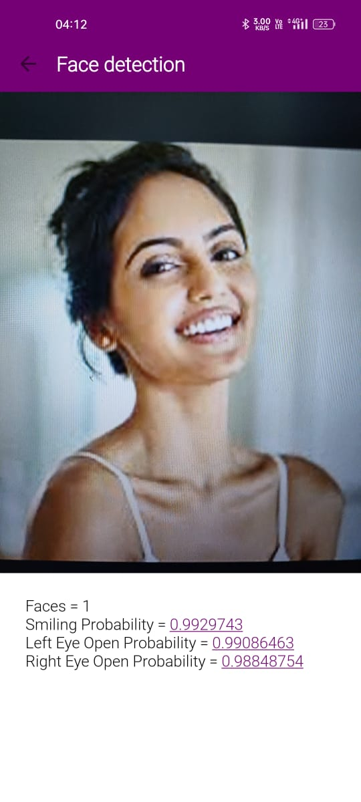
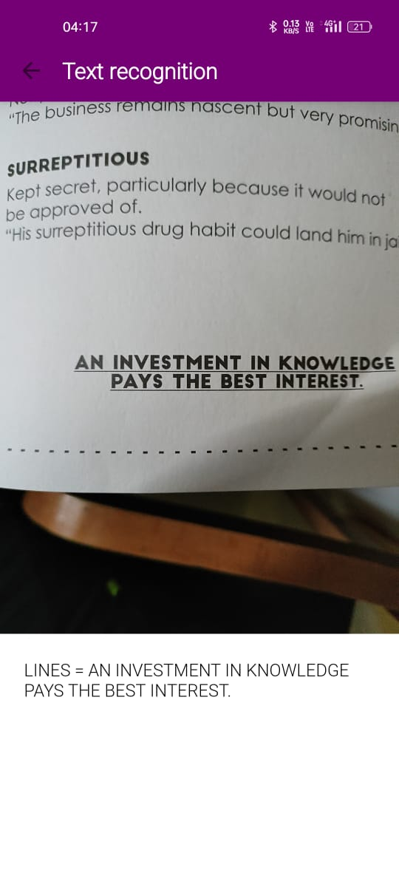
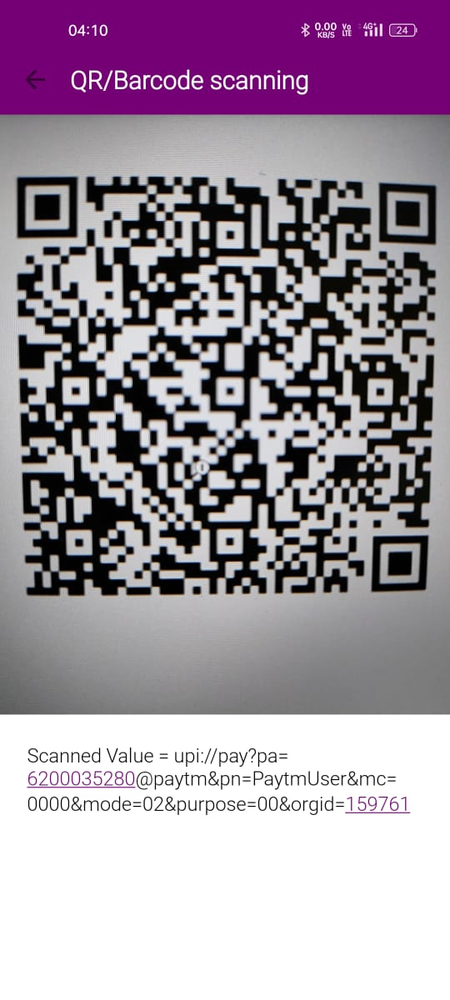
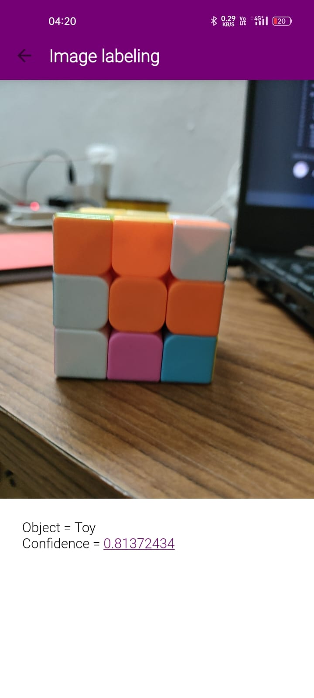

# Iscan
Iscan uses Google's ML Kit for Barcode scanning, Face recognition, Text recognition, and Image labeling.

# How to implement?

1. Clone the repo or download the source code on your local machine.
2. Add the necessary dependencies.

# 📷 Screenshots

## Splash Screen, Login, Registration

        

## Text Recognition, Face Detection

        

## Image Labelling, BarCode/QrCode Scanner

        

## 🔥 Features
 - It uses Google's ML Kit to scan images
 - QR/Barcode Scanning
 - Face Recognition
 - Image Labeling
 - Text Recognition
 
  ## 🛠 Tech Used
 - Android
 - Google ML Kit
 - Kotlin programming language
 - Lottie Animations
